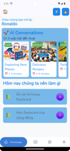

# Flashcard Learning App


A mobile application built with **Flutter** to help users learn through interactive flashcards and AI-powered conversations. This project aims to provide an engaging learning experience with a clean UI, smooth loading states, and efficient data handling.

---

## Table of Contents

- [Features](#features)
- [Screenshots](#screenshots)
- [Installation](#installation)
- [Usage](#usage)
- [Project Structure](#project-structure)
- [Technologies Used](#technologies-used)
- [Contributing](#contributing)
- [License](#license)

---

## Features

- **Flashcard System**: Interactive cards with customizable content for learning.
- **AI Conversations**: Simulated conversations powered by AI to enhance language skills.
- **Loading Overlay**: Custom loading overlay with animated visuals (e.g., a jumping cat) for smooth user experience during data fetching.
- **Shimmer Effect**: Skeleton loading UI using the `shimmer` package to display placeholders while fetching data.
- **Provider State Management**: Efficient state management for handling conversations and user data.
- **Responsive Design**: Optimized for both Android and iOS platforms.
- **Splash Screen Customization**: Previously implemented with `flutter_native_splash` (now reverted to default).

---

## Screenshots

### Home Screen with Flashcards


### AI Conversation with Shimmer Loading


### Loading Overlay


### Home Screen with Flashcards


### AI Conversation with Shimmer Loading


### Loading Overlay


---

## Installation

### Prerequisites
- [Flutter SDK](https://flutter.dev/docs/get-started/install) (version 3.x or higher)
- [Dart](https://dart.dev/get-dart) (version 2.x or higher)
- An IDE (e.g., Android Studio, VS Code)
- Android/iOS emulator or physical device

### Steps
1. **Clone the Repository**
   ```bash
   git clone https://github.com/your-username/flashcard-learning-app.git
   cd flashcard-learning-app
2. **Install Dependencies**
   ```bash
   flutter pub get
2. **Run Code**
   ```bash
   flutter run


### Usage
- Launch the App: Open the app to see the default splash screen (Flutter logo) followed by the home screen.
- Explore Flashcards: Navigate through the flashcard section to view learning content.
- AI Conversations: Access the "AI Conversations" section, where cards display a shimmer effect while data loads from the AI backend. Once loaded, interact with the conversation cards.
- Loading Feedback: During data fetching, or shimmer effect provides visual feedback.

## Technologies Used
Flutter: Cross-platform framework for building the app.
Dart: Programming language for Flutter.
Provider: State management for handling data and UI updates.
Shimmer: Package for skeleton loading effects.

Android/iOS: Native configurations for platform-specific features.

```bash
   flashcard-learning/
   ├── android/              # Android native files
   ├── ios/                  # iOS native files
   ├── lib/
   │   ├── ui/               # UI components and screens
   │   │   ├── home/         # Home screen and widgets
   │   │   │   ├── widgets/  # Reusable widgets (e.g., CardCustom)
   │   │   └── conversation_ai_screen.dart  # AI conversation screen
   │   ├── utils/            # Utility files (colors, enums)
   │   ├── view_models/      # View models for state management
   │   └── main.dart         # App entry point
   ├── assets/               # Images and static resources
   ├── pubspec.yaml          # Dependencies and configuration
   └── README.md             # Project documentation


